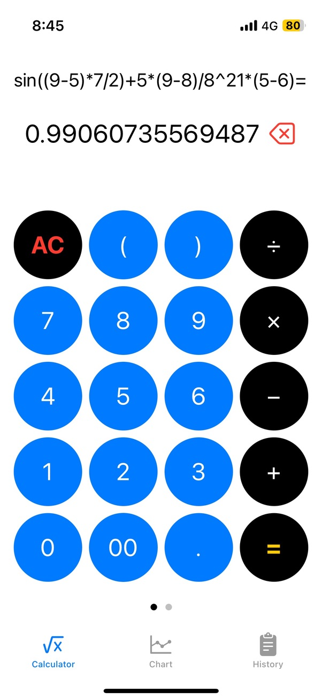
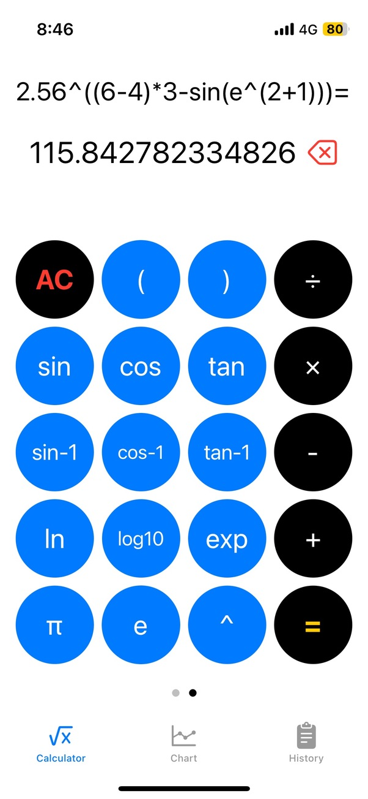
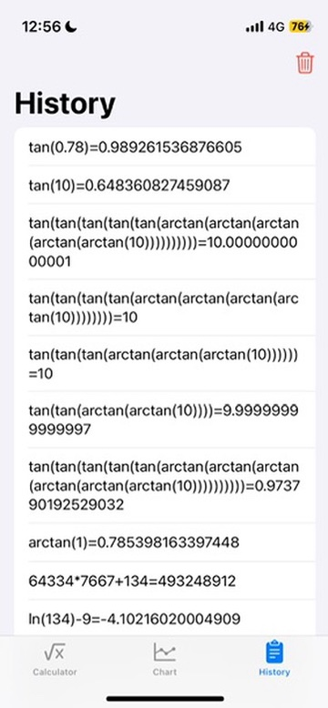
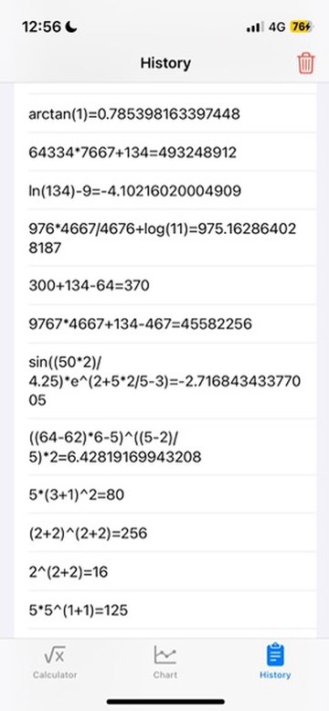
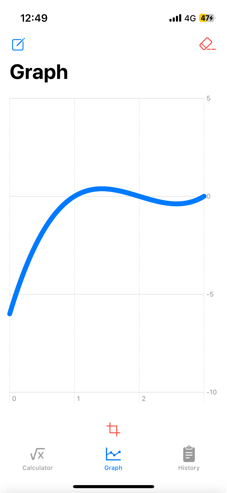

# Calculator

## Feature

Long expression parse

Support multiple brackets

Support Basic elementary functions

Get the value of a parametric expression

SwiftUI interface

Haptic feedback on keyboard

Calculation history

Darw function graph

## Build 
Build with Xcode (You may need Xcode Version 16.0 (16A242d) or above to build).

For systems other than macOS, you can build a standalone console Calculator app. Navigate to `/Calculator/CoreCalculator`, and build with CMake. 

Note that if your're using gcc on Windows, you may encounter the problem that the programme cannot properly parse your expression.

## Calculator Architecture Overview
The UI is written taking the advantage of SwiftUI. 

The core calculation function is written with C.

Use C++ String to wrap C Style char arries, so that the Calculation function can better communicate with the GUI.
